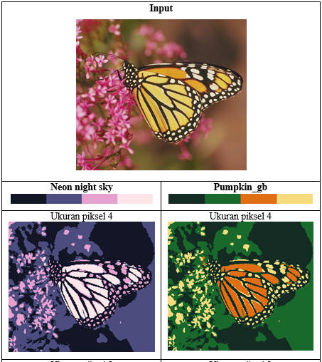
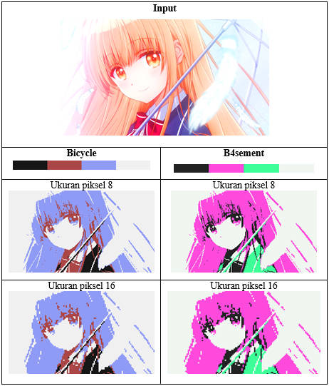

# 2-bit Pixel Art Generator
## How to run
```sh
python main.py -h
```
Then follow the instructions. For example:
```sh
python main.py 4.png 4 sunset_lattern --save 4-pixel.png
```


## Examples
### Butterfly

### Mahiru
